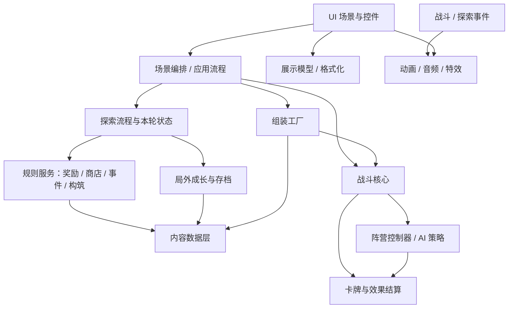

# 架构拆分与商业化迭代约束

## 文档定位

本文档是《太玄宗》长期迭代的架构约束文档。以后新增系统、扩展内容、调整规则、优化 UI、拆分代码或接手新对话时，都应先对照本文档判断改动是否符合当前架构方向。

本文档不记录世界观设定，不替代 `游戏设计总览.md`、`数据表与内容配置规划.md`、`UI与交互规范.md`。它只回答一个问题：为了让 Godot 4 Demo 能持续演进到商业化标准，系统边界、依赖方向和模块职责应该如何保持清晰。

当前项目还处于原型期，已有代码允许存在过渡层和兼容门面，但新功能不应继续扩大混杂职责。重构也不要求一次完成，应按本文档分阶段迁移，保证每一步都能测试和回退。

## 默认工作协议

本文档不是仅供人工阅读的说明，而是后续每次开发的默认约束。用户提出新增卡牌、敌人、UI、规则、事件、数值或系统时，即使用户没有特别提到“架构”“拆分”“文档”，接手者也应默认按本文档先做归属判断。

执行顺序：

1. 先判断需求属于内容数据、文本本地化、规则服务、运行状态、战斗核心、控制器、UI、表现层、设置、存档还是测试。
2. 再查是否已有对应模块或同类规则组，优先扩展现有模块。
3. 只有现有模块无法表达、且该能力有复用价值时，才新增小规则、小数据字段或小服务。
4. 如果只是单个内容、单个敌人、单个界面、单个动画或单个功能临时需要，不应直接写一套长期平行系统。
5. 如果必须做临时特例，必须在回复中说明“这是临时例外”，并在本文档或对应设计文档记录最终应归属的模块。
6. 改动完成后，根据改动类型同步文档和测试，不等待用户额外提醒。

接手者的自我警告：

- 不要为了快速完成当前需求，把新规则直接写进最近的调用方。
- 不要因为只改一个具体内容，就给它写一串专属执行逻辑。
- 不要因为只加一个界面，就让 UI 直接拥有核心规则。
- 不要因为当前代码还有过渡文件，就继续扩大过渡文件职责。
- 不要把“能跑”当成“架构合格”；能复用、能扩展、能定位、能测试才算合格。
- 不要把“只改一处”当成可以绕过质量检查；检查范围可以小，但必须覆盖本次触碰模块和同类落点。

## 自检范围控制

每次迭代都要做架构和质量自检，但自检范围按改动范围调整，避免小任务被全项目检查拖垮。

| 改动范围 | 自检范围 | 必做检查 | 不要求 |
| --- | --- | --- | --- |
| 单点小改 | 当前文件、直接调用方、对应模块文档 | 是否放在正确模块、是否引入重复逻辑、是否需要定向 smoke | 全项目重扫、跨系统重构 |
| 同模块扩展 | 当前模块、同类 helper / service、相关测试 | 是否复用现有入口、是否有平行系统、是否扩大混杂文件职责 | 无关模块重构 |
| 跨模块功能 | 触碰到的所有模块、依赖方向、入口和回流 | 数据 / 规则 / UI / 表现是否分离，文档和回归测试是否覆盖 | 不相关旧债一次性清完 |
| 架构拆分 | 被迁移职责、兼容门面、旧调用方、标准回归 | 行为不变、依赖方向正确、旧入口可用、架构文档同步 | 顺手重写玩法或大范围调参 |

低质量代码的判定标准：

- 同一事实或规则在多个文件重复维护。
- 为单个内容、单个按钮、单个事件写长期专属流程。
- UI、动画、音频或设置代码直接改变核心结算。
- 数据、规则、执行、展示、保存混在同一个临时调用方里。
- 新增代码绕过已有数据库、规则服务、设置层、本地化层或素材授权层。
- 只靠当前改动者记忆才能继续维护，缺少稳定 id、文档或测试。
- 为了当前需求制造以后难以删除的兼容分支。

自检结论不需要每次长篇汇报。小改可以只在最终结果里说明验证；跨模块或架构改动必须主动说明触碰边界、风险和测试。

## 数据与执行分离

商业化长期迭代的默认方向是：数据系统描述“有什么”，规则 / 执行系统解释“怎么运行”，UI 和表现层只负责“怎么展示和反馈”。

全项目都遵守这个分离，不只适用于卡牌：

- 角色、敌人、召唤物、法宝单位等基础数值和标签属于角色 / 单位数据源。
- 卡牌 id、分数、标签、描述、效果步骤配置属于卡牌数据源。
- UI 文案、设置文案、菜单文案和未来多语言文本属于本地化文本数据源。
- 敌方卡组模板、角色引用、抽牌数和主题标签属于敌方卡组模板数据源。
- 难度曲线、节点收益、成长价格、商店价格、卡包归属属于对应数据或规则服务。
- 战斗结算、效果解释、目标选择、响应窗口、入卡去向、事件结算属于规则 / 执行系统。
- UI 只读取数据和状态，触发操作请求，不能反向定义规则。
- 动画、音频和特效只响应事件或读取只读展示数据，不能反向修改结算。

新增功能时优先增加“可被规则解释的数据字段”或“可复用的小规则步骤”，而不是把数据、判断、执行、展示混在一个调用方里。

## 总原则

- 大系统必须分开：战斗核心、内容数据、文本本地化、遭遇组装、探索流程、局外成长、UI、动画、音频、设置 / 输入 / 显示、素材授权、存档和测试各自有明确边界。
- 小系统内部暂不强制极致拆分。只有当某类能力被多张卡、多个敌人、多个界面或多个流程重复使用时，再抽成通用模块。
- 同一类事实只能有一个主要来源。角色基础模板、卡牌定义、职业包装、卡组模板、难度曲线、成长定义、商店规则都不能在多个文件里长期重复维护。
- 玩家和敌方不应拥有两套战斗规则。底层都应使用单位、阵营、牌库、手牌、放置区、墓地、除外区、卡牌结算和效果结算这一套框架。
- 差异来自数据和控制器，不来自重复系统。玩家是 `BattleSide + HumanController`，敌方是 `BattleSide + AIController`，完整牌手 Boss 也应是同一套框架的不同配置。
- UI 只展示状态、收集输入、发出操作请求和呈现反馈，不拥有核心规则，不直接决定奖励池、战斗结算、成长加成、敌方模板或卡牌效果。
- 动画、音频和特效属于表现层。核心系统只发事件，不直接知道播放哪个动画、哪个音效或哪个 UI 特效。
- 允许兼容门面，避免大改一次性爆炸。拆分时旧 API 可以暂时保留，但内部应转发到新模块，并在文档中记录迁移方向。
- 不引入已被当前设计排除的平行规则：当前不做同名卡数量限制、稀有度式禁限、强制删牌式肉鸽逻辑或局内 Boss 后境界突破。

## 依赖方向

目标依赖方向如下：

禁止反向依赖：

- `scripts/battle/` 不应依赖 `scripts/ui/`、场景节点、音频节点、地图 UI 或角色准备页。
- 内容数据文件不应依赖 UI、运行时场景或具体节点。
- UI 不应绕过规则服务直接拼奖励、改成长、决定敌方遭遇或实现卡牌效果。
- 音频和动画不应反向修改战斗规则；只能响应事件或读取只读展示数据。

Godot 约束：

- 纯数据、规则服务和工厂优先使用 `RefCounted` 或静态函数；需要进入场景树、接收输入或管理可视节点时才使用 `Node` / `Control`。
- 场景 `.tscn` 负责结构和展示承载，不作为规则数据库。
- 信号适合 UI、动画、音频和流程编排；核心规则仍应由明确的方法和数据结构驱动。
- 不为了方便把所有服务做成 Autoload。只有跨场景长期存在、确实需要全局访问的服务才考虑 Autoload。
- GDScript 中动态字典返回值要尽量配显式局部类型，避免 `Variant` 推断导致解析问题。

## 目标模块边界

| 模块 | 负责 | 不负责 | 当前状态 |
| --- | --- | --- | --- |
| `BattleUnit` | 所有战斗单位的生命、攻防、状态、资源、装备和基础字段 | 职业成长、敌方卡组、UI 展示 | 已有基础，应继续作为统一单位模型 |
| `BattleSide` | 阵营牌手区域：牌库、手牌、墓地、除外、放置区、抽牌数、单位引用 | 玩家专属规则、敌方专属规则、UI 可见性以外的展示逻辑 | 已有基础，敌我应继续共用 |
| `DeckManager` | 卡牌实例、抽牌、洗牌、移动牌区 | 奖励池、商店、构筑限制、卡牌定义维护 | 已有基础，后续减少外部重复牌区操作 |
| `BattleManager` | 回合、阶段、事件窗口、胜负、阵营行动推进 | 查数据库组装遭遇、UI、音频、敌方专属卡牌映射 | 已移除对敌方数据库的直接查询，并把基础行动规则迁出，当前仍偏宽 |
| `BattleEncounterRuntime` | 战斗运行期遭遇适配：选择遭遇、生成敌方主单位、敌方牌组 profile、抽牌数和出牌额度 | 角色 / 卡组模板 / 难度数据维护、战斗结算、AI 策略 | 本轮新增，`BattleManager` 已改用 |
| `BattleActionRules` | 普通攻击目标、普通攻击伤害、防御加成、攻击修正清理等基础行动规则 | 时点窗口、胜负、动画、AI 决策 | 本轮新增，先承接低风险行动规则 |
| `CardResolver` / `EffectResolver` | 统一卡牌使用、响应、效果步骤、目标解析 | 卡牌池、商店价格、UI 预览文案 | 伤害步骤已进一步收口到 `EffectResolver`，后续继续迁移通用效果 |
| `CharacterDatabase` | 所有角色 / 敌人 / 召唤物 / 法宝单位模板 | 初始牌组、职业成长、敌方卡组模板 | 已在阶段 1 拆出，玩家职业已通过 `JobDatabase.character_id` 引用 |
| `JobDatabase` | 玩家可选职业 / 角色包装，引用 `character_id`，持有初始牌组、职业卡池、说明 | 重复维护单位基础模板、局外成长存档 | 已在阶段 2 改为引用角色池，旧返回字段兼容 |
| `CardDefinitionDatabase` | 全部卡牌定义、卡牌类型常量、基础卡牌分数读取 | 卡包、奖励池、商店、构筑、卡牌实例 uid | 本轮新增，新增普通卡牌默认落点 |
| `CardDatabase` | 卡牌实例创建、旧兼容入口、给旧调用方补解锁元数据 | 长期维护卡包、奖励池、商店、构筑所有规则 | 已缩为兼容门面，旧入口转发到定义库和卡池库 |
| `CardPoolDatabase` | 编号卡包、通用 / 职业卡池、奖励池过滤、随机奖励卡、商店库存和买卖价格 | 卡牌效果、卡牌实例 uid、UI 展示、构筑合法性 | 已直接读取 `CardDefinitionDatabase` |
| `EnemyDeckTemplateDatabase` | 敌方阵营卡组模板，引用角色池 | 角色基础属性、难度曲线、最终遭遇组装 | 已在阶段 1 拆出 |
| `DifficultyCurveDatabase` | 层数、节点位置、遭遇类型、世界难度带来的数值修正 | 角色模板、卡组模板、UI 展示 | 已在阶段 1 拆出 |
| `EncounterFactory` | 卡组模板 + 角色模板 + 难度曲线 => 战斗遭遇数据 | 战斗流程、奖励、UI、音频 | 已在阶段 1 拆出 |
| `SideController` / `EnemyAIController` | 决定阵营如何选择出牌、目标和行动 | 底层牌区规则、卡牌效果本身 | 阶段 3 已抽出敌方 AI 控制器第一轮，执行结算仍在 `BattleManager` |
| `RunState` | 本轮探索状态：层数、HP、卡组、备牌、灵石、完成节点、局外成长写入；战斗启动、战斗回流和放弃探索提交入口 | 事件规则、商店规则、奖励池算法、探索结算公式、UI 覆盖层 | 已转发构筑、奖励、商店、事件、节点完成、休息、结算、战斗启动和战斗回流规则 |
| `ExplorationRules` | 节点修为、节点完成收益、休息恢复、探索通关 / 失败结算数值 | 状态保存、存档写入、UI 展示、卡牌奖励池 | 阶段 4 已新增第一轮 |
| `RewardService` | 战斗奖励、宝箱卡牌候选、事件卡牌来源和奖励数值 | 卡牌定义、UI 展示、直接改状态、探索结算公式、卡牌获得落点 | 阶段 4 已新增第一轮，获得落点已迁出 |
| `CardAcquisitionRules` | 获得一张卡后的合法性检查、进入当前卡组或备牌区、结果消息 | 奖励池生成、商店库存、事件候选、UI 展示 | 本轮新增，奖励 / 商店 / 事件 / 战斗奖励共用 |
| `ShopService` | 坊市库存、价格、刷新、购买和出售规则 | UI 按钮、卡牌定义本体 | 阶段 4 已新增第一轮 |
| `EventService` | 事件选项、代价、收益、结果描述和事件结果计算 | UI 卡片布局、长期状态保存 | 阶段 4 已新增事件选项与结果第一轮 |
| `ProgressionDatabase` | 成长项定义、价格、分类、加成字段、称号阈值、层倍率 | 存档读写、UI 展示 | 本轮已从 `MetaProgression` 拆出 |
| `MetaProgression` / 存档仓库 | 按职业保存累计修为、已花费、成长等级，处理购买和当前加成汇总 | 职业基础数据、战斗规则、UI 分组布局、成长定义维护 | 已改为读取 `ProgressionDatabase`，旧静态入口保留兼容 |
| UI 场景 / 应用流程 | 展示数据、输入操作、弹窗、拖拽、结果预览、场景切换和信号连接 | 核心规则、数据源、战斗结算、奖励生成、探索状态提交、战斗参数组装 | 阶段 4 已把构筑、奖励、商店、事件、宝箱、休息、探索结算、战斗启动和战斗回流规则迁入服务，UI / `Main.gd` 仍承担场景编排 |
| `UIStyleFactory` | 通用面板样式、按钮三态样式和基础 StyleBox 生成 | 业务流程、布局结构、卡牌展示分类、动画时序 | 本轮新增，多个 UI 场景已改为薄包装调用 |
| `DeckBuilderViewFactory` | 构筑两栏面板、构筑卡牌按钮和构筑展示容器生成 | 构筑合法性、保存状态、探索备牌数据、职业备选池数据 | 本轮新增，准备页和地图页已共用展示生成 |
| `MapModalChoiceFactory` | 探索地图弹窗中的卡牌选择网格、卡牌选项、奖励伪卡和通用操作按钮生成 | 事件 / 商店 / 宝箱 / 休息规则、节点完成、资源扣除、卡牌获得去向 | 本轮新增，`MapScene.gd` 保留流程提交，弹窗选项展示迁入工厂 |
| `CardInteractionRules` | 手牌按钮前缀、出牌动画前缀、拖拽落点、是否需要敌方目标等 UI 交互判断 | 卡牌结算、效果执行、战斗胜负、卡牌数据定义 | 本轮新增，先收口 `BattleUI.gd` 中的手牌交互判断 |
| `CardDisplayRules` | 卡牌类型展示、标签展示、触发时点展示、分数读取、卡牌色板、描边颜色和放置区基础颜色 | 卡牌效果执行、卡牌池归属、构筑合法性、战斗结算 | 本轮新增，先收口卡牌按钮、tooltip、出牌描边和槽位基础颜色 |
| `VisualAssetDatabase` | UI 贴图、静态场景图、角色精灵、战斗动画、图标和 VFX 的资源 id、未来路径、占位色 | 战斗规则、UI 布局、角色数值、具体动画播放时序 | 本轮新增，先建立素材分区和占位资源 id |
| `CharacterVisualDatabase` | 角色 / 敌方视觉 profile，绑定头像、战斗精灵、默认动画、图标和占位色 | 角色基础属性、职业成长、敌方卡组、战斗结算 | 本轮新增，角色池只引用 `visual_profile_id` / `animation_profile` |
| `BattlePresentationRouter` | 战斗事件到视觉表现动作、VFX、卡牌运动的映射 | 修改战斗事件结果、播放音频、创建具体节点和 Tween | 本轮新增，先作为动画 / 特效路由占位 |
| `BattleAudioRouter` | 战斗事件类型到音效事件名的映射 | 创建音频节点、生成音频流、修改战斗事件或结算 | 本轮新增，`BattleUI.gd` 负责转发事件和播放 |
| `AudioEventDatabase` | 音频事件、类别、音量、冷却、未来音频路径和占位音色 id | 播放节点、程序合成音效、战斗事件到音效的映射 | 本轮新增，`AudioManager.gd` 改为读取该数据库 |
| `MusicManager` | 背景音乐播放节点、当前曲目、循环和音乐音量 | 音频事件定义、战斗结算、UI 按钮音效、素材授权 | 本轮新增，主菜单 / 地图 / 战斗已通过音乐事件占位切换 |
| `GameSettings` | 显示、音频、玩法、辅助功能和输入设置的默认值与清洗 | 保存文件、UI 控件、实际应用窗口或音频节点 | 本轮新增，作为设置数据唯一结构来源 |
| `SettingsStore` | `user://settings.cfg` 读写、设置更新入口 | 设置默认值定义、具体窗口应用、UI 控件布局 | 本轮新增，主菜单音量已保存到该入口 |
| `DisplayModeManager` | 16:9 分辨率档、窗口模式、垂直同步和等比留黑策略应用 | UI 布局规则、素材缩放、运行中业务状态 | 本轮新增，项目固定 1920x1080 基准与常见分辨率档 |
| `InputActionDatabase` / `InputSettings` | 输入动作 id、默认绑定、绑定显示、玩家绑定应用和 fallback | 战斗规则、UI 页面布局、具体按钮行为结算 | 本轮新增，主流程启动时统一应用输入绑定，设置页已接入键盘主绑定 |
| `LocalizationDatabase` / `LocalizationService` | 语言列表、文本 id、各语言文本、缺失回退和参数替换 | UI 布局、规则结算、文本保存、机器翻译调用 | 本轮新增，主菜单 / 设置页已接入第一批文本 |
| `SaveMigrationService` | 存档类型、schema 版本、设置 / 局外成长迁移和旧字段兼容 | 具体玩法规则、UI、文件路径选择、存档展示 | 本轮新增，设置和局外成长已接入第一轮 |
| `AssetAttributionDatabase` | 素材来源、作者、授权、商用许可和未知素材检查 | 资源加载、视觉展示、音频播放、图片路径维护 | 本轮新增，后续导入商用素材必须登记授权 |
| `BattleFloatingTextRules` | 战斗事件到浮动文字、颜色和受击反馈标记的映射 | 选择目标控件、创建动画节点、修改战斗事件或结算 | 本轮新增，`BattleUI.gd` 负责根据结果找到显示对象 |
| 音频 / 动画 / 特效 | 响应事件并呈现反馈 | 修改核心规则、决定结算 | 音效映射已开始独立，动画和特效仍主要在 UI 内 |

## 常见需求落点

| 需求类型 | 优先落点 | 不应落点 | 说明 |
| --- | --- | --- | --- |
| 新增普通卡牌 / 调整卡面字段 | `CardDefinitionDatabase` | UI、战斗流程、事件服务、卡池规则 | 只改数据时不要改结算流程；卡包归属另改 `CardPoolDatabase`。 |
| 新增可复用卡牌效果 | `EffectResolver` / `CardResolver` 的通用效果步骤 | 具体内容专属硬编码、UI 文案解析 | 多张卡或多个敌人可能复用时，补通用步骤。 |
| 新增特殊内容 / 特殊能力 | 先判断能否由现有数据字段、规则步骤或组件组合；不能组合时再考虑通用小步骤 | 为该内容写独立流程分支 | 若确实临时特例，必须报备并记录后续归属。 |
| 新增敌方单位 / Boss 单位 | `CharacterDatabase` | 敌方卡组模板、战斗管理器 | 单位模板只描述基础数值、标签、行动序列。 |
| 新增敌方卡组 / 首领牌包 | `EnemyDeckTemplateDatabase` | 角色模板、战斗管理器 | 卡组模板引用角色，角色不反向决定卡组。 |
| 调整敌方数值曲线 | `DifficultyCurveDatabase` | 角色模板散改、UI | 层数、节点位置、遭遇类型和世界难度修正集中维护。 |
| 调整遭遇组装规则 | `EncounterFactory` / `BattleEncounterRuntime` | `BattleManager` 直接查数据库 | 内容组装和战斗运行期适配分开。 |
| 新增奖励候选来源 | `RewardService` / `CardPoolDatabase` | UI、地图节点脚本 | 奖励来源和卡池过滤不要写到界面。 |
| 获得卡牌后的去向 | `CardAcquisitionRules` | 奖励、商店、事件各自判断 | 当前卡组能否加入、否则进备牌区，由统一规则判断。 |
| 调整构筑合法性 | `DeckBuildRules` | 准备页、地图页、奖励入口重复判断 | 张数、卡组总分、阻塞原因统一维护。 |
| 新增商店规则 | `ShopService` / `CardPoolDatabase` | `MapScene` 按钮回调 | UI 只提交购买、出售、刷新请求。 |
| 新增事件选项或事件代价 | `EventService` | `MapScene` 弹窗里直接结算 | UI 展示选项，事件服务计算结果。 |
| 新增局外成长项 | `ProgressionDatabase`，购买与存档走 `MetaProgression` | 角色池、战斗单位模板 | 成长定义和成长存档分开。 |
| 改探索节点收益 / 休息 / 结算 | `ExplorationRules` | 地图 UI、结算 UI | 数值规则不进展示层。 |
| 改战斗 AI 策略 | `EnemyAIController` / 后续控制器 | `BattleManager` 大分支 | AI 决定选择，不重新实现效果。 |
| 改 UI 展示 | UI 场景 / 通用 UI 组件 | 规则服务、数据表 | UI 只展示和提交请求。 |
| 改通用面板 / 按钮样式 | `UIStyleFactory` | 各场景重复 `_panel_style` / `_style_button` | 视觉参数集中维护，场景只传入差异参数。 |
| 改构筑两栏展示 | `DeckBuilderViewFactory` / 调用场景 | `DeckBuildRules`、`RunState`、职业数据源 | 展示生成和构筑合法性 / 保存提交分离。 |
| 改探索弹窗选项展示 | `MapModalChoiceFactory` / `MapScene` | `RunState`、`RewardService`、`ShopService`、`EventService`、`DeckBuildRules` | 选项怎么显示进工厂；选项代表什么、是否可买、买后怎么改状态仍由探索流程和服务决定。 |
| 改卡牌显示分类 / tooltip / 色系 | `CardDisplayRules` / `CardButton` / `CardTooltip` | `CardDefinitionDatabase`、`CardResolver`、`BattleManager` | 展示文案和颜色属于 UI 展示规则，不写进数据表或结算流程。 |
| 改手牌交互规则 | `CardInteractionRules` / UI 组件 | `BattleManager`、卡牌效果结算 | 拖拽落点、按钮前缀和目标需求判断不要散落在界面回调中。 |
| 改战斗音效映射 | `BattleAudioRouter` / `AudioManager` | 战斗结算、规则服务、动画节点 | 事件到音效名的选择进路由，实际音频流仍由 `AudioManager` 管。 |
| 改背景音乐 | `MusicManager` / `AudioEventDatabase` | 场景按钮回调、战斗结算、地图规则 | 音乐事件先登记到音频事件库，何时切换由应用流程调用音乐管理器。 |
| 导入 / 替换视觉素材 | `VisualAssetDatabase` / `CharacterVisualDatabase` / `BattlePresentationRouter` | `BattleManager`、`CardResolver`、角色数值数据库、UI 流程 | 素材路径和占位色进资源库，角色只引用 profile，战斗事件只映射表现动作。 |
| 导入 / 替换音频素材 | `AudioEventDatabase` / `AudioManager` / `BattleAudioRouter` | 战斗结算、UI 按钮流程、规则服务 | 音频事件定义和路径进数据库，播放交给 `AudioManager`，事件选择交给路由。 |
| 登记素材授权 | `AssetAttributionDatabase` / 素材规范文档 | 资源加载器、UI、战斗或音频播放代码 | 正式素材进入项目前记录来源、作者、授权和商用许可，不清楚授权的素材不能当正式商用资产。 |
| 改战斗浮动文字 | `BattleFloatingTextRules` | `BattleManager`、`CardResolver`、具体动画节点 | 事件到文案 / 颜色的映射集中维护，UI 只负责呈现。 |
| 改动画、音频、特效 | 表现层事件订阅者 | 战斗结算、规则服务 | 表现层响应事件，不改变结果。 |
| 改分辨率 / 窗口模式 / 垂直同步 | `GameSettings` / `DisplayModeManager` / `SettingsStore` | 任意 UI 场景或主流程临时写 DisplayServer 调用 | 当前固定 16:9 和等比留黑；新增档位先改显示管理器，再由设置页提交。 |
| 改快捷键 / 操作绑定 | `InputActionDatabase` / `InputSettings` / `SettingsStore` | `BattleUI`、地图 UI 或按钮回调里直接判断物理按键 | 功能代码读动作，不读具体键位；键位只存在输入设置层。 |
| 改设置保存 | `GameSettings` / `SettingsStore` | 单个界面自行写 `user://` 文件 | 设置结构和保存入口统一，界面只展示和提交修改。 |
| 改 UI / 设置 / 菜单文案 | `LocalizationDatabase` / `LocalizationService` | UI 场景里长期硬写显示文本 | 新文本先给稳定 text id，中文和英文可先并行维护；机器翻译结果也进入文本库，不进 UI 代码。 |
| 改存档字段 / 存档版本 | `SaveMigrationService` + 对应存档仓库 | 直接在读取处临时兼容、让 UI 自己修旧数据 | 先定义 schema 版本和迁移，再让具体存档入口调用。 |

## 全系统可复用能力扩展规则

新增能力时先判断它是“组合已有能力”“扩展通用能力”还是“临时特例”。

- 组合已有能力：优先用现有数据字段、规则服务、效果步骤、状态、资源、目标选择、事件和 UI 组件组合实现。
- 扩展通用能力：当多张卡、多个敌人、多个职业、多个事件、多个 UI 页面、多个动画反馈或多个流程会使用同类能力时，给现有规则组增加小能力。
- 临时特例：如果能力只服务一个具体内容或一个短期功能，且当前阶段确实不值得抽象，允许短期特例，但必须满足“局部、可删除、可迁移、有记录”四个条件。

适用范围：

- 卡牌效果：优先组合已有 `effect_steps`；不能表达时补通用效果步骤。
- 敌方行为：优先扩展 AI 策略和数据配置；不要在战斗主流程写某个敌人的专属大分支。
- 探索事件：优先扩展 `EventService` 的选项和结果模型；不要在地图 UI 里直接结算特殊事件。
- 奖励和商店：优先扩展卡池、价格和入卡规则；不要在单个按钮回调里写专属经济逻辑。
- 局外成长：优先扩展 `ProgressionDatabase` 定义和 `MetaProgression` 存档逻辑；不要塞进角色池或战斗单位。
- UI 展示：优先扩展通用组件参数；不要为每个页面复制一套卡牌展示或规则判断。
- 动画 / 音频 / 特效：优先扩展事件响应；不要在表现层决定战斗或探索结果。

临时特例必须主动报备：

- 说明为什么现有数据字段、规则组或组件不能表达。
- 说明为什么暂不抽成通用能力。
- 说明写入了哪个文件、最终应该迁到哪个模块。
- 在修改记录或本文档的架构债务里留下记录。

内容能力的默认规则：

- 新内容优先是数据新增。
- 新规则优先扩展现有规则组。
- 新执行逻辑优先做成可复用的小步骤，而不是绑定某个具体内容。
- 描述文本只展示规则结果，不作为规则解析来源。
- 不能为了单个内容在 `BattleManager`、UI、事件、商店、动画或音频代码里写专属结算。

## 统一系统要求

### 单位统一

所有战斗对象都应来自统一单位模型：

- 玩家默认主单位。
- 普通敌人。
- 精英。
- 首领。
- 召唤物。
- 未来法宝单位。
- 未来完整牌手 Boss 的场上单位。

角色池只描述单位基础模板：是谁、基础数值、标签、默认行动、技能、动画占位。角色池不描述初始牌组、职业卡池、局外成长、敌方卡组模板或遭遇选择。

玩家职业可以引用角色池中的单位模板，但职业包装必须单独保存：

- `character_id`
- 初始牌组
- 职业卡池 / 卡包前缀
- 职业说明
- UI 展示字段
- 可用局外成长树 id

### 阵营牌手统一

战斗底层只有阵营牌手，不区分“玩家专属战斗系统”和“敌人专属战斗系统”。

每个阵营都应使用：

- `BattleSide`
- `DeckManager`
- 阵营单位列表
- 抽牌数
- 手牌 / 牌库 / 墓地 / 除外 / 放置区
- 卡牌结算入口
- 目标选择规则

玩家和敌方的差异应来自：

- 控制器：玩家点击、敌方 AI、脚本化 Boss、自动测试控制器。
- 数据：初始牌组、敌方模板、抽牌数、起始手牌、行动偏好。
- 可见性：UI 是否展示敌方手牌和牌区。
- 局外来源：玩家有职业成长，普通敌方一般没有。

### 卡牌和效果统一

所有卡牌必须在统一卡牌数据库中有定义。敌方和我方可以使用不同来源、不同限制和不同 AI 策略，但不能维护两套卡牌效果。

优先方向：

- 卡面数据负责描述卡。
- `CardResolver` 负责使用流程。
- `EffectResolver` 负责可复用效果步骤。
- 敌方出牌也尽量走同一套卡牌结算。
- 敌方 AI 只决定“打哪张牌、选哪个目标、是否保留”，不重新实现卡牌效果。

允许短期过渡：少量敌方主动牌可以暂时有 AI profile，但新增内容时应优先补通用效果步骤，而不是扩展硬编码映射。

### 局外成长统一

局外成长本质是数值和解锁修正系统，不是战斗流程的一部分。

它应输出明确修正：

- 最大生命修正。
- 攻击修正。
- 防御修正。
- 基础抽牌修正。
- 卡组总分上限修正。
- 编号卡包解锁修正。
- 开局资源或职业特殊修正。

这些修正由组装层应用到本轮探索或我方阵营。UI 只展示成长项和购买结果，不自己解释成长如何进入战斗。

### 探索流程统一

探索是战斗外的运行流程，不应混入战斗核心。

长期边界：

- `RunState` 保存本轮状态。
- `MapGenerator` 生成节点图。
- `ExplorationRules` 判断节点可选、完成、休息、层间推进、结算。
- `RewardService` 生成奖励候选。
- `ShopService` 管理坊市。
- `EventService` 生成事件选项并计算事件结果。
- `DeckBuildRules` 判断卡组和备牌调整是否合法。

UI 可以展示地图和覆盖层，但事件收益、商店库存、宝箱奖励和结算数值应由规则服务返回。

### UI 组件统一

通用 UI 组件应复用，不为每个界面复制一套卡牌展示：

- 卡牌按钮。
- 卡牌 tooltip。
- 卡牌列表 / 网格。
- 奖励卡展示。
- 卡组 / 备牌双栏构筑。
- 资源和状态摘要。
- 确认弹窗。

同一种展示规则只维护一次。例如“构筑、奖励、坊市显示单卡分数，战斗手牌不显示分数”应通过组件参数控制，不在多个场景里复制判断。

### 表现层统一

战斗、探索和 UI 操作应发出稳定事件，动画、音频和特效响应这些事件。

核心事件例子：

- `card_played`
- `card_set`
- `card_equipped`
- `damage_applied`
- `healed`
- `status_changed`
- `unit_defeated`
- `turn_started`
- `response_window_opened`
- `battle_won`
- `node_completed`
- `reward_chosen`
- `shop_item_bought`

核心系统不直接播放音效，不创建动画节点，不依赖具体 UI 控件。

## 当前过渡状态

这些混杂点已经存在，后续应逐步收口：

- `EnemyDatabase.gd` 已缩为兼容门面，旧入口继续转发到 `CharacterDatabase`、`EnemyDeckTemplateDatabase` 和 `EncounterFactory`。后续调用方可逐步改用新模块。
- `JobDatabase.gd` 已通过 `character_id` 引用 `CharacterDatabase.gd` 中的剑修 / 符修基础模板。旧 `get_job()` 返回字段继续兼容 UI 和战斗入口。
- `BattleManager.gd` 已通过 `BattleEncounterRuntime.gd` 获取战斗运行期敌方遭遇、主单位、牌组 profile、抽牌数和出牌额度，不再直接查询 `EnemyDatabase.gd`；敌方出牌优先级、行动队列、下一行动和敌方主动牌 profile 已迁入 `EnemyAIController.gd`；普通攻击目标、普通攻击伤害、防御加成和攻击修正清理已迁入 `BattleActionRules.gd`；敌方行动执行、时点和结算仍保留在 `BattleManager.gd`。
- `CardDefinitionDatabase.gd` 已承接全部卡牌定义、类型常量和基础分数读取；`CardPoolDatabase.gd` 已承接活跃卡包、卡池、奖励池和商店价格查询，并直接读取卡牌定义库；`CardDatabase.gd` 已缩为兼容门面，保留旧入口、卡牌实例 uid 和解锁元数据补齐。
- `RunState.gd` 同时保存探索状态并写入局外成长；构筑合法性已转发到 `DeckBuildRules.gd`，奖励数值和奖励卡牌来源已转发到 `RewardService.gd`，奖励 / 商店 / 事件 / 战斗奖励的入卡去向已转发到 `CardAcquisitionRules.gd`，坊市库存、刷新、购买和出售已转发到 `ShopService.gd`，事件种类、事件选项和普通 / 奇遇 / 交易事件结果已转发到 `EventService.gd`，节点修为、休息恢复和探索结算数值已转发到 `ExplorationRules.gd`，战斗启动、战斗回流和放弃探索已通过 `RunState` 统一提交。
- `ProgressionDatabase.gd` 已承接成长项定义、称号阈值和层倍率；`MetaProgression.gd` 继续负责职业修为点、成长等级存档、购买和加成汇总，旧静态定义入口暂时保留兼容。
- `MapScene.gd` 仍承担地图弹窗和节点完成入口调用；`Main.gd` 仍承担场景切换和信号连接。卡组调整保存已通过 `RunState` / `DeckBuildRules` 校验，卡牌奖励来源已通过 `RunState` / `RewardService` 取得，坊市操作已通过 `RunState` / `ShopService` 提交，事件选项和事件结果已通过 `RunState` / `EventService` 取得，宝箱和休息结果已通过 `RunState` / `RewardService` / `ExplorationRules` 提交，战斗启动、战斗完成和放弃探索已通过 `RunState` 返回流程结果。
- `CharacterPrepScene.gd` 与 `MapScene.gd` 的构筑合法性已共用 `DeckBuildRules.gd`，但卡牌池展示组件仍可继续收敛。
- 战斗音效映射已通过 `BattleAudioRouter.gd` 从 `BattleUI.gd` 的事件分支中迁出；战斗浮动文字映射已通过 `BattleFloatingTextRules.gd` 收口；手牌交互判断已通过 `CardInteractionRules.gd` 收口；卡牌按钮、tooltip、出牌描边和放置区基础颜色已开始通过 `CardDisplayRules.gd` 统一；通用面板和按钮样式已开始通过 `UIStyleFactory.gd` 生成；构筑两栏展示已通过 `DeckBuilderViewFactory.gd` 共用；地图弹窗的卡牌 / 奖励选项展示已通过 `MapModalChoiceFactory.gd` 收口。视觉素材库、角色视觉 profile、战斗表现路由、音频事件库、背景音乐管理器和素材授权库已建立第一轮占位边界；具体动画播放组件、粒子 / 序列帧适配和完整设置页的键位 / 辅助功能部分仍待后续补充。
- 设置基础层已建立第一轮边界：`GameSettings.gd` 统一设置结构和清洗，`SettingsStore.gd` 统一保存到 `user://settings.cfg`，`DisplayModeManager.gd` 统一 16:9 分辨率 / 窗口模式 / 垂直同步应用，`InputActionDatabase.gd` / `InputSettings.gd` 统一输入动作、默认绑定、绑定显示和绑定应用，`LocalizationDatabase.gd` / `LocalizationService.gd` 统一语言列表、文本 id、文本回退和参数替换。主流程启动时应用输入、显示和音乐设置；主菜单当前已暴露主音量、音乐音量、音效音量、分辨率、窗口模式、垂直同步、语言切换和键盘快捷键重绑定，辅助功能设置后续再扩。

过渡期要求：

- 不在混杂文件里继续加入新的大类职责。
- 若必须修改混杂文件，优先把新增逻辑写成可迁移的小函数，并记录目标归属。
- 新增数据结构时先判断它属于内容数据、运行状态、规则服务还是 UI 展示，不直接塞进最近的调用方。
- 大范围迁移时保留兼容门面，先让行为不变，再逐步改调用方。

## 分阶段重构任务表

### 阶段 1：敌方遭遇底座拆分

状态：已完成第一轮文件拆分。目标仍是行为不变，只搬数据和接口。

新增或调整：

- `CharacterDatabase`
- `EnemyDeckTemplateDatabase`
- `DifficultyCurveDatabase`
- `EncounterFactory`
- `EnemyDatabase` 保留为兼容门面

验收：

- 旧入口 `EnemyDatabase.character_template()`、`deck_templates_for()`、`get_encounter_for_battle()` 行为不变。
- `BattleManager` 通过 `BattleEncounterRuntime` 读取运行期遭遇数据；旧 `EnemyDatabase` 门面继续供兼容测试和旧调用方使用。
- `PrototypeSmokeTest.gd`、`RunFlowSmokeTest.gd`、`LayoutSmokeTest.gd` 通过。

### 阶段 2：职业包装和角色池统一

状态：已完成第一轮兼容迁移。目标是玩家主单位也来自统一角色池，职业只做包装。

新增或调整：

- `JobDatabase` 增加 `character_id`。
- 玩家基础模板从 `CharacterDatabase` 读取。
- `PlayerBuildFactory` 或等价组装函数应用职业、开局构筑和局外成长。
- 保留旧 `get_job()` 返回字段，直到 UI 和战斗入口迁移完。

验收：

- 剑修 / 符修开局数值不变。
- 角色准备页展示不变。
- 战斗开局和局外成长加成不变。

### 阶段 3：阵营控制器和敌方 AI 抽离

状态：已完成第一轮兼容迁移。当前先把敌方决策迁出 `BattleManager`，敌方行动的执行、时点窗口和伤害结算仍保留在 `BattleManager`。

目标：敌方不再在 `BattleManager` 里硬编码出牌系统。

新增或调整：

- `SideController`
- `HumanBattleController`
- `EnemyAIController`
- 敌方出牌优先级和目标选择策略迁出 `BattleManager`

验收：

- 敌方仍按当前模板抽牌和出牌。
- 敌方卡牌能逐步改走统一 `CardResolver` / `EffectResolver`。
- 响应窗口、胜负判定和回合推进不变。

### 阶段 4：探索规则服务拆分

状态：已完成构筑、奖励、商店、事件选项、事件结果、探索运行规则、战斗启动和战斗回流第一轮收敛。`DeckBuildRules.gd` 已承接 10-20 张、卡组总分上限和加卡阻塞原因；`CardAcquisitionRules.gd` 已承接获得卡牌后的合法性、入当前卡组 / 备牌区和结果消息；`RewardService.gd` 已承接战斗奖励、宝箱 / 事件卡牌来源和奖励数值；`ShopService.gd` 已承接坊市库存、刷新费用、购买和出售；`EventService.gd` 已承接事件种类、低收益 / 奇遇 / 交易选项生成和事件结果计算；`ExplorationRules.gd` 已承接节点修为、节点完成收益、休息恢复和探索结算数值；`RunState.battle_start_payload(...)` 已承接战斗启动参数组装；`RunState.apply_battle_completion(...)` 已承接战斗回流、首领层间推进和最终结算触发。更完整的流程编排仍可后续继续收敛。

目标：`RunState` 保存状态，规则服务计算结果。

新增或调整：

- `ExplorationRules`
- `RewardService`
- `CardAcquisitionRules`
- `ShopService`
- `EventService`
- `DeckBuildRules`

验收：

- 地图节点、事件、宝箱、坊市、休息行为不变。
- `MapScene` 逐步只展示选项并提交选择。
- 构筑合法性在准备页和地图页共用。

### 阶段 5：卡牌数据库瘦身

状态：已完成卡牌定义库和卡池数据库第一轮拆分。`CardDefinitionDatabase.gd` 已承接全部卡牌定义、卡牌类型常量和基础分数读取；`CardPoolDatabase.gd` 已承接编号卡包、通用 / 职业卡池、奖励池过滤、按分数随机取卡、商店库存和买卖价格，并直接依赖定义库；`CardDatabase.gd` 已缩为兼容门面，继续保留旧入口、卡牌实例 uid 和解锁元数据补齐。

目标：卡牌定义、卡池、奖励、商店、构筑规则分离。

新增或调整：

- `CardDefinitionDatabase`
- `CardPoolDatabase`
- `CardUnlockDatabase`
- `RewardPoolService`
- `ShopPricingService`
- `CardDatabase` 保留为兼容门面

验收：

- 所有现有卡牌 id、分数、标签、效果不变。
- 奖励池和坊市库存与当前规则一致。
- 卡包解锁 UI 数据不变。

### 阶段 6：表现层事件化

状态：已完成第一轮低风险拆分。战斗音效映射、手牌交互判断、卡牌展示规则、视觉资源库、角色视觉 profile、战斗表现路由、音频事件库和背景音乐管理器已经从大 UI / 播放器文件中迁出一部分，动画和特效仍保留在 UI 内等待后续收口。

目标：动画、音频和特效独立响应事件。

新增或调整：

- 统一战斗 / 探索事件命名。
- `BattleAudioRouter` 维护战斗事件到音效事件名的映射；`AudioManager` 继续负责音频流、冷却和播放。
- `AudioEventDatabase` 维护音频事件、类别、音量、冷却和未来素材路径；新增音效或音乐占位先登记到这里。
- `MusicManager` 维护背景音乐播放、曲目切换、循环和音乐音量；具体音乐事件仍登记在 `AudioEventDatabase`。
- `VisualAssetDatabase` 维护视觉素材 id、分类、未来路径和占位色；真实贴图、精灵、图标、VFX 和战斗动画资源先登记到这里。
- `CharacterVisualDatabase` 维护角色视觉 profile；角色池和职业包装只引用 profile，不直接写资源路径。
- `BattlePresentationRouter` 维护战斗事件到视觉表现动作的映射；具体节点、Tween、粒子或序列帧播放器后续再接入。
- `CardInteractionRules` 维护手牌交互展示判断，避免拖拽目标和按钮前缀继续散落在 UI 回调中。
- `CardDisplayRules` 维护卡牌展示分类、tooltip 辅助文本和基础色板，避免多个 UI 组件各自判断卡牌类型。
- 动画和特效从规则代码中剥离。

验收：

- 战斗、奖励、节点操作仍有反馈。
- 核心规则不直接依赖音频或动画节点。

### 阶段 7：产品基础层

状态：已完成第一轮底座。当前已建立设置结构、显示模式、输入动作、本地化文本、存档版本迁移、音乐管理和素材授权登记，并在主菜单提供最小音频 / 显示 / 语言 / 键盘绑定设置 UI；动画速度和辅助功能 UI 后续再扩。

目标：让商业化常见基础能力不散落在主菜单、战斗 UI 或场景流程里。

新增或调整：

- `GameSettings` 维护设置默认值和清洗，包含当前语言 id。
- `SettingsStore` 维护 `user://settings.cfg` 读写和设置更新入口。
- `DisplayModeManager` 维护固定 16:9 分辨率档、窗口模式、垂直同步和等比留黑策略。
- `InputActionDatabase` / `InputSettings` 维护输入动作、默认绑定、绑定显示和玩家绑定应用。
- `LocalizationDatabase` / `LocalizationService` 维护语言列表、文本 id、缺失回退和参数替换。
- `SaveMigrationService` 维护存档 schema 版本、设置迁移和局外成长迁移。
- `MusicManager` 维护背景音乐播放。
- `AssetAttributionDatabase` 维护素材来源和商用授权登记。
- `project.godot` 固定 1920x1080 基准、不可随意拖动窗口、等比缩放留黑。

验收：

- 主流程启动时会加载设置并应用输入、显示、语言和音乐音量。
- 设置页可以改键盘主绑定并恢复默认。
- 设置结构、显示档位、快捷键动作、文本本地化和存档迁移能通过原型烟测读取。
- 新增素材和音乐前有明确登记点，不需要改战斗或 UI 规则。
- 后续完整设置页只调用设置层，不直接写窗口、键位或音频保存逻辑。

## 变更等级

每次任务开始前先给改动定级。定级不是流程负担，而是为了决定应该查哪些模块、更新哪些文档、跑哪些验证。

| 等级 | 范围 | 允许做法 | 必须避免 | 文档和验证 |
| --- | --- | --- | --- | --- |
| 内容改动 | 新卡、新敌人、新卡组模板、数值微调 | 改数据表或内容数据库 | 新增平行规则、散改多个来源 | 更新内容 / 数据文档；跑相关 smoke 或定向探针 |
| 规则改动 | 新效果步骤、新状态、新目标规则、新奖励规则 | 扩展现有 resolver / rules / service | 单项内容专属硬编码、UI 直接结算 | 更新架构和设计 / 数据文档；跑原型 smoke |
| 流程改动 | 探索、商店、事件、奖励、结算、战斗回流 | 改 `RunState` 入口和规则服务 | UI 绕过状态入口直接改结果 | 更新架构、数据规划、交接说明；跑 RunFlow |
| UI 改动 | 展示、布局、按钮、弹窗、拖拽 | UI 读状态、提交请求、复用组件 | UI 持有核心规则 | 更新 UI 规范；跑 Layout |
| 表现改动 | 动画、音频、特效 | 响应事件和只读展示数据 | 改战斗或探索结算 | 更新 UI / 表现约定；做对应显示验证 |
| 产品基础改动 | 设置、分辨率、窗口模式、输入绑定、语言文本、存档版本、音量、素材授权 | 改设置 / 显示 / 输入 / 本地化 / 存档迁移 / 素材授权模块，UI 只提交配置 | 单个场景直接保存设置、硬写按键、硬写长期文本、临时兼容旧存档或绕过授权登记 | 更新架构、UI / 音频 / 素材 / 数据规范；跑原型 smoke |
| 架构改动 | 新模块、职责迁移、依赖方向变化 | 保留兼容门面、行为不变优先 | 一次性大搬且缺少测试 | 必须更新本文档、修改记录和交接说明；跑标准回归 |

默认验证策略：

- 代码行为改动不能只看 `git diff` / `git status`。
- 优先使用 Godot 无头测试和定向探针。
- GUI 检查是补充，不作为本项目默认验收前提。
- 既有 `ObjectDB instances leaked at exit` 警告如果只在 RunFlow / Layout 退出时出现，按当前记录视为既有警告，不单独阻塞。

## 架构债务清单

以下是当前已知过渡点。后续需求如果触及这些区域，应优先顺手收口，但不要为了清单本身做无边界大重构。

| 债务 | 当前状态 | 后续方向 |
| --- | --- | --- |
| `BattleManager` 仍偏宽 | 已移出敌方数据库查询和部分 AI 决策，但仍持有回合、时点、执行、胜负和部分奖励流 | 后续按战斗时点、行动执行、响应窗口、胜负事件逐步拆 |
| `CardDatabase` 兼容门面仍存在 | 卡牌定义和卡池已迁出，但旧入口仍集中保留 | 新调用方走 `CardDefinitionDatabase` / `CardPoolDatabase`，确认旧调用减少后再评估移除 |
| 敌方卡牌仍有少量 AI profile 过渡 | 敌方出牌策略已迁到 `EnemyAIController`，但完整通用结算仍需继续推进 | 新敌方牌优先补通用效果步骤 |
| UI 组件复用不彻底 | 构筑两栏展示、卡牌展示规则和地图弹窗选项展示已开始收口，但更完整的弹窗组件和复杂列表状态仍可继续组件化 | 后续抽稳定展示组件，不复制规则判断 |
| 表现层事件化不足 | 音效映射、浮动文字、手牌交互判断、部分卡牌展示规则、通用样式生成、视觉资源库、角色视觉 profile 和战斗表现路由已先行拆出，但具体动画播放、粒子 / 序列帧和部分 UI 反馈仍散落在 `BattleUI.gd` | 后续建立事件订阅式动画 / 特效播放器，并继续收敛通用 UI 展示组件 |
| 设置页仍未覆盖全部设置 | 设置、显示、输入、本地化、存档迁移、音乐和授权底座已建立；主菜单已暴露音频、显示、语言和键盘主绑定设置，但未提供鼠标 / 手柄绑定、冲突提示、动画速度和辅助功能设置 | 后续设置页按 `GameSettings` 分类展示，不让 UI 直接写窗口、键位、长期文本或保存文件 |
| `RunState` 仍承担较多流程入口 | 已把规则计算迁出，但仍是探索状态和提交入口中心 | 保持状态入口统一，只有当流程继续膨胀时再拆应用服务 |
| 兼容门面较多 | `EnemyDatabase`、`CardDatabase`、`MetaProgression`、`RewardService` 均有兼容入口 | 新调用方走新模块，旧入口逐步减少 |

## 每次迭代前检查

开始做任何新功能或重构前，即使用户没有要求，也先在内部回答：

1. 这个改动属于哪个模块？是否跨模块？
2. 它新增的是数据、规则、状态、UI、表现，还是控制策略？
3. 现有是否已经有同类系统？能否复用或扩展，而不是新建平行系统？
4. 它是否会让 UI 承担核心规则？
5. 它是否会让战斗核心依赖探索、局外成长、UI、音频或具体场景？
6. 它是否重复维护角色、卡牌、职业、成长、奖励或难度数据？
7. 它是否新增玩家可见文本？如果是，是否应该进入本地化文本库而不是长期硬写在 UI 中？
8. 如果是过渡实现，最终目标模块是什么？是否需要兼容门面？
9. 需要更新哪些文档和哪些无头测试？
10. 如果它是单个内容、单个敌人、单个界面、单个动画或单个流程特例，是否已经确认不能用通用能力组合实现？
11. 如果需要新增通用能力，它应该加到哪个现有规则组，而不是新建平行系统？

如果任一问题暴露架构风险，应在回复中主动说明风险和处理方式，而不是静默写代码。

## 每次迭代后检查

完成改动后，即使用户没有要求，也至少检查：

- 新增逻辑是否进入了正确模块。
- 是否出现重复规则或重复数据源。
- 是否新增了长期硬编码文本、按键、路径、授权、设置保存或存档迁移逻辑。
- 是否扩大了已知混杂文件的职责。
- 是否保留了被当前设计排除的旧系统。
- 是否更新了受影响文档。
- 是否跑了对应无头检查或定向验证。
- 是否有临时特例；如果有，是否已记录最终归属。
- 是否让后续新增同类内容更容易，而不是更依赖当前改动者的记忆。

涉及架构边界变化时，必须更新本文档。涉及玩法规则时更新 `游戏设计总览.md`。涉及数据字段时更新 `数据表与内容配置规划.md`。涉及 UI 行为时更新 `UI与交互规范.md`。涉及当前接手状态时更新 `太玄宗_卡牌战斗原型_当前状态与交接说明.md`。

## 禁止清单

- 禁止为了单个功能、单个内容、单个界面、单个动画或单个音效新建长期平行系统。
- 禁止为了单个需求复制一套玩家 / 敌方专属战斗系统。
- 禁止把数据定义、规则判断、执行结算、UI 展示和表现反馈混写在同一个临时调用方里。
- 禁止让角色模板反向决定敌方卡组。
- 禁止把局外成长塞进角色池。
- 禁止从 UI 文案或卡面描述反向解析规则。
- 禁止把长期 UI / 设置 / 菜单文本只硬写在场景脚本中；新增稳定文本应进入本地化文本库。
- 禁止在具体 UI、战斗或运行流程中临时修旧存档；存档字段兼容必须进入迁移服务。
- 禁止在 UI 场景里新增长期核心规则。
- 禁止在音频、动画或特效代码里改变战斗结算。
- 禁止引入当前规则明确排除的同名卡限制、稀有度限制、强制删牌、局内 Boss 后突破成长。
- 禁止为了短期方便在多个文件维护同一张卡、同一个角色、同一个成长项或同一条难度曲线。

## 第一批应优先落地的结构改动

优先顺序：

1. 已完成：拆 `EnemyDatabase` 为角色池、敌方卡组模板、难度曲线和遭遇工厂，保留旧门面，并新增 `BattleEncounterRuntime` 让战斗运行期不再直接查询敌方数据库。
2. 已完成：让 `JobDatabase` 通过 `character_id` 引用角色池，停止重复维护玩家主单位模板。
3. 已完成第一轮：把敌方出牌策略从 `BattleManager` 抽到 AI 控制器。
4. 已完成第一轮：把准备页和地图页重复的构筑合法性收敛到 `DeckBuildRules`。
5. 已完成第一轮探索规则服务：奖励数值和奖励卡牌来源已迁入 `RewardService`；奖励 / 商店 / 事件 / 战斗奖励的入卡去向已迁入 `CardAcquisitionRules`；坊市库存、刷新、购买和出售已迁入 `ShopService`；事件种类、事件选项和普通 / 奇遇 / 交易事件结果已迁入 `EventService`；节点修为、休息恢复和探索结算数值已迁入 `ExplorationRules`；战斗启动、战斗回流、首领层间推进和放弃探索已迁入 `RunState` 统一入口。
6. 已完成第二轮：新增 `CardDefinitionDatabase` 并让 `CardPoolDatabase` 直接读取定义库；`CardDatabase` 已缩为兼容门面，后续只在确认旧调用减少后再移除兼容入口。
7. 已完成第一轮：新增 `BattleActionRules`，基础普通攻击目标 / 伤害和防御加成规则已从 `BattleManager` 迁出；时点窗口和敌方行动执行暂不硬拆。
8. 已完成第一轮：新增 `ProgressionDatabase`，成长项定义、称号阈值和层倍率已从 `MetaProgression` 存档类中拆出。
9. 已完成表现层第一轮：新增 `CardInteractionRules`、`CardDisplayRules`、`BattleAudioRouter`、`BattleFloatingTextRules`、`UIStyleFactory`、`DeckBuilderViewFactory`、`MapModalChoiceFactory`、`VisualAssetDatabase`、`CharacterVisualDatabase`、`BattlePresentationRouter`、`AudioEventDatabase` 与 `MusicManager`，手牌交互判断、卡牌展示规则、战斗音效映射、浮动文字映射、通用样式生成、构筑两栏展示、地图弹窗选项展示、视觉资源占位、角色视觉包装、战斗表现路由、音频事件定义和背景音乐播放已从大 UI / 播放器文件中迁出；具体动画播放器、特效节点和更完整的通用 UI 组件继续作为后续拆分目标。
10. 已完成产品基础层第一轮：新增 `GameSettings`、`SettingsStore`、`DisplayModeManager`、`InputActionDatabase`、`InputSettings`、`LocalizationDatabase`、`LocalizationService`、`SaveMigrationService` 和 `AssetAttributionDatabase`，设置结构、设置保存、固定 16:9 显示档位、窗口模式、垂直同步、输入动作、默认快捷键、文本本地化、存档版本迁移和素材授权登记已有统一落点；主菜单已接入音频、显示、语言和键盘快捷键重绑定，动画速度和辅助功能 UI 后续再扩。

这个顺序的理由是：先建立内容数据和战斗底座边界，再统一玩家与敌方，最后拆 UI 和探索流程。这样每一步都能保持可运行，不需要一次性重写整个 Demo。
